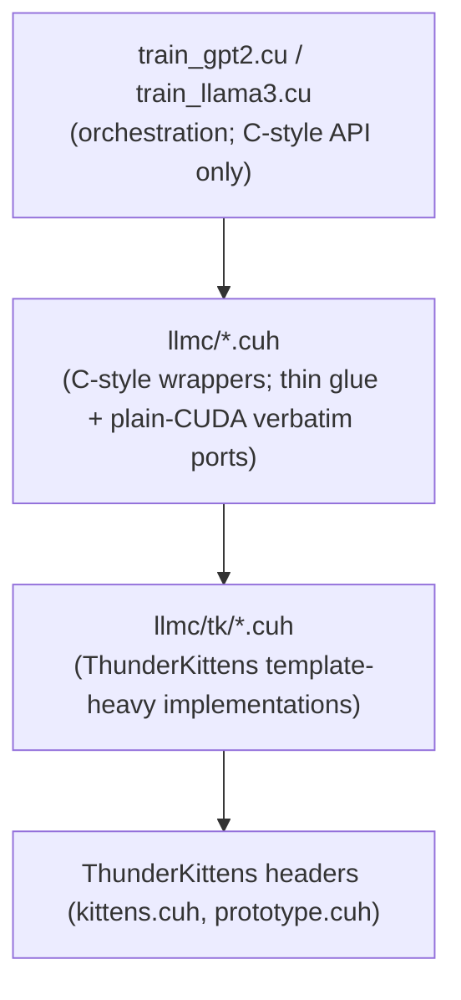

# Architecture

llm.kittens is a single-binary C++/CUDA trainer. Same shape as `llm.c`, but
every tile-shaped kernel is built on ThunderKittens (TK) primitives. Element-wise
and gather/scatter kernels stay as plain CUDA — TK adds nothing on those workloads.

This page covers the **layering rule**, the file-by-file responsibility map, the
**allocator alignment** constraint, and where to put new code.

## Layering

Three layers, strictly enforced:



**Rule 1 — `train_*.cu` `#include`s only `llmc/*.cuh`.** Never `llmc/tk/*.cuh`
directly. The training source stays free of TK template noise.

**Rule 2 — Only files under `llmc/tk/` may `#include <kittens.cuh>` or use the
`kittens::` namespace.** This makes `llmc/tk/tk_common.cuh` the single bridge
between the C-style world and TK's template world.

**Rule 3 — `llmc/*.cuh` wrappers expose C-style function signatures.** Concrete
shape: take raw `floatX*` buffers (where `floatX = __nv_bfloat16` is locked) and
a `cudaStream_t`. No TK templates leak through this boundary.

The bridge file [`llmc/tk/tk_common.cuh`](../llmc/tk/tk_common.cuh) hard-asserts
the BF16 constraint, requires `KITTENS_SM90`, and provides:

- `llmk::bf16` aliasing `kittens::bf16` (which itself aliases `__nv_bfloat16`).
- `llmk::to_bf16(...)` reinterpret-cast helpers.
- `llmk::TK_ALIGN = 128` — the TMA-descriptor alignment constant.
- `llmk::tk_set_max_dynamic_smem(fn)` — the boilerplate `cudaFuncSetAttribute` opt-in for the full H100 dynamic shared-memory budget that TK kernels expect.

## File-by-file map

```
llm.kittens/
├── Makefile                  Build (sm_90a, c++20, BF16, TK include paths). docs/build-and-run.md.
├── README.md                 Project story.
├── goal.md                   Master TODO. Single source of truth.
├── CHANGELOG.md              Append-only history.
├── docs/                     This documentation set.
├── llms.txt                  Concise LLM index.
├── llms-full.txt             Full-tree ingestion bundle.
│
├── train_gpt2.cu             GPT-2 / GPT-3 entrypoint, compile-ready; runtime parity pending.
├── train_llama3.cu           [M6 trainer/checkpoint-resume ✓ / H100 validation pending] Llama-3 entrypoint.
├── train_gpt2.py             PyTorch reference / .bin exporter (verbatim).
├── train_llama3.py           HF→.bin converter.
├── dev/validate_gpt2_starter_pack.py Host-only GPT-2 starter-pack artifact validator plus self-test.
├── dev/validate_data_artifacts.py Host-only GPT-2/Llama train/eval data artifact validator plus self-test.
├── dev/validate_attention_gqa_reference.py CPU-only GQA/RoPE PyTorch reference check.
├── dev/validate_profile_parser.py Host-only profile CSV parser/threshold validator.
├── dev/validate_log_tools.py Host-only training-log validator expected-metric and pass/fail smoke.
├── dev/validate_llama3_converter.py Host-only Llama write_model header/payload validator.
├── dev/validate_nccl_source.py Host-only source guard for brittle NCCL count, stream-order, and ZeRO runtime contracts.
├── dev/validate_build_contracts.py Host-only source guard for BF16/H100/TK build contracts.
├── dev/validate_epilogue_source.py Host-only source guard for the opt-in GPT-2 bias+GELU epilogue and profile mode.
├── dev/validate_gqa_source.py Host-only source guard for GQA/RoPE routing and coverage contracts.
├── dev/validate_runtime_markers.py Host-only source guard for runtime success-marker contracts.
├── dev/validate_training_source.py Host-only source guard for rank-0 training-log evidence contracts.
├── dev/validate_profile_source.py Host-only source guard for Nsight Compute profile-gate contracts.
├── dev/validate_llama_conversion_source.py Host-only source guard for Llama-3.1 8B conversion contracts.
├── dev/validate_goal_harness_coverage.py Host-only source guard for compile, goal-complete, and runtime-evidence coverage.
├── dev/cuda/gpt2_validate.cu Forward-only GPT-2 loss gate, compile-ready; runtime pending.
├── test_gpt2.cu              Numerical-parity test, compile-ready; runtime parity pending.
├── profile_gpt2.cu           ncu profiling target, compile-ready; supports --gelu-fusion 0|1; runtime pending.
├── profile_gpt2cu.py         ncu post-processor, adapted to TK-only build flags; supports raw CSV input and --gelu-fusion.
├── dev/test_dataloader.cpp   Host-only GPT-2/Llama DataLoader/EvalLoader smoke.
├── requirements.txt          Python deps for dataset prep only.
│
├── llmc/                     Kernel + utility headers (the C-style API).
│   ├── cuda_common.h         floatX = __nv_bfloat16 (locked); compile-error on FP16/FP32.
│   ├── cuda_utils.cuh        x128, f128, stochastic_rounding (verbatim).
│   ├── cublas_common.h       Stub. cuBLAS removed in v1.
│   ├── matmul.cuh            [M2 fwd ✓ / M3 bwd ✓ / M8 epilogue compile] TK-backed GEMM wrapper + bias-grad reduce.
│   ├── attention.cuh         [M2 fwd ✓ / M3 bwd ✓] TK MHA fwd/bwd with fallback for unsupported bwd shapes.
│   ├── attention_gqa.cuh     [M6 TK fwd ✓ / supported bwd ✓] GQA + RoPE attention.
│   ├── layernorm.cuh         [M2 fwd ✓ / M3 bwd ✓] TK LayerNorm fwd + fused-residual; TK warp-sum bwd reductions.
│   ├── rmsnorm.cuh           [M6 ✓ / test_rmsnorm compile] Llama-3 RMSNorm: TK fwd + fused-residual, CUDA bwd.
│   ├── rope.cuh              [M6 ✓ / test_rope compile] Llama-3 rotary embedding wrapper.
│   ├── encoder.cuh           Token+pos embedding (verbatim plain CUDA).
│   ├── gelu.cuh              GELU (verbatim plain CUDA).
│   ├── swiglu.cuh            [M6 ✓ / test_swiglu compile] Llama-3 SwiGLU activation (plain CUDA).
│   ├── fused_classifier.cuh  Cross-entropy + softmax + dlogits (verbatim plain CUDA).
│   ├── adamw.cuh             AdamW step (verbatim plain CUDA).
│   ├── global_norm.cuh       Grad-clip norm (verbatim plain CUDA).
│   ├── zero.cuh              NCCL + ZeRO-0/1/2/3 + multi-node init; ZeRO-3 parameter shards all-gather into the full compute layout.
│   ├── dataloader.h          Distributed train/eval loaders (GPT-2/Llama header dispatch).
│   ├── tokenizer.h, sampler.h, schedulers.h, rand.h, mfu.h,
│   ├── outlier_detector.h, logger.h, utils.h    (all verbatim from llm.c)
│   └── tk/                   ThunderKittens-namespace files.
│       ├── tk_common.cuh                  Bridge: bf16 alias, TK_ALIGN, smem helper, BF16 static_assert.
│       ├── gemm_h100.cuh                  TK bf16 GEMM in header form; opt-in bias+GELU epilogue compile-wired.
│       ├── attention_h100.cuh             TK MHA fwd (`T % 192 == 0`) + bwd (`T % 256 == 0`) kernels
│       ├── attention_gqa_h100.cuh         TK GQA fwd + supported bwd [M6 partial; tile-load RoPE compile; runtime pending]
│       ├── layernorm_tk.cuh               TK LayerNorm forward + fused-residual wrappers (✓)
│       ├── rmsnorm_tk.cuh                 TK RMSNorm forward + fused-residual wrapper (✓ compile-ready)
│       └── rope_tk.cuh                    TK RoPE wrapper (✓ compile-ready)
│
├── dev/
│   ├── cuda/                 Scratch / kernel smoke tests.
│   │   ├── test_matmul.cu          GEMM forward, opt-in bias+GELU epilogue, and dWeight smoke test (✓; `make test_matmul`).
│   │   ├── test_attention.cu       GPT MHA smoke harness (✓ compile; runtime pending).
│   │   ├── test_layernorm.cu       GPT LayerNorm smoke harness (✓ compile; runtime pending).
│   │   ├── cuda_runtime_check.cu   CUDA driver/runtime/device probe.
│   │   ├── test_rope.cu            RoPE smoke harness (✓ compile; runtime pending).
│   │   ├── test_rmsnorm.cu         RMSNorm smoke harness (✓ compile; runtime pending).
│   │   ├── test_swiglu.cu          SwiGLU smoke harness (✓ compile; runtime pending).
│   │   └── test_attention_gqa.cu   GQA + RoPE smoke harness (✓ compile; runtime pending).
│   ├── data/                 Mirror of llm.c/dev/data/. Tokenizers + dataset prep.
│   ├── test_dataloader.cpp        Host-only C++ train/eval loader format smoke.
│   ├── download_starter_pack.sh   Fetches GPT-2 124M reference checkpoints.
│   ├── validate_gpt2_starter_pack.py  Checks GPT-2 tokenizer/checkpoints/debug-state without CUDA plus synthetic self-test.
│   ├── validate_data_artifacts.py      Checks prepared GPT-2/Llama train/eval `.bin` files without CUDA plus synthetic self-test.
│   ├── validate_attention_gqa_reference.py  Checks GQA/RoPE reference math without CUDA.
│   ├── validate_profile_parser.py      Checks profile parser thresholds without `ncu`.
│   ├── validate_log_tools.py           Checks training-log expected metrics and validators with synthetic logs.
│   ├── validate_llama3_converter.py    Checks Llama `write_model` header/payload order without HF weights.
│   ├── validate_nccl_source.py          Checks scalar NCCL count, all-gather stream-order, and ZeRO runtime contracts.
│   ├── validate_build_contracts.py      Checks Makefile, BF16 precision, TK bridge, and cuBLAS shim contracts.
│   ├── validate_epilogue_source.py      Checks TK/template, matmul, GPT-2 `-ge`, profile mode, launch-script, and smoke coverage for bias+GELU epilogue.
│   ├── validate_gqa_source.py           Checks GQA/RoPE tile-load routing, head mapping, and smoke/reference coverage.
│   ├── validate_runtime_markers.py      Checks runtime success markers asserted by the H100 harness.
│   ├── validate_training_source.py      Checks logger/trainer/harness rank-0 training-log evidence contracts.
│   ├── validate_profile_source.py       Checks ncu metric, threshold, parser, binary, and harness profile contracts.
│   ├── validate_llama_conversion_source.py Checks HF alias, checkpoint validation, C++ dry-parse, and llama8b-convert contracts.
│   ├── validate_goal_harness_coverage.py Checks compile targets, goal-complete phases, fail-fast prerequisites, thresholds, and unchecked runtime evidence mapping.
│   └── download_llama3.py         Converts gated HF Llama-3 weights to `.bin` and validates checkpoint headers/sizes.
│
├── scripts/                  H100×8 single-node training scripts.
│   ├── run_gpt2_124M.sh      [ported M4; runtime pending]
│   ├── run_gpt2_350M.sh      [ported M4; runtime pending]
│   ├── run_gpt2_774M.sh      [ported M4; runtime pending]
│   ├── run_gpt2_1558M.sh     [ported M4; runtime pending]
│   ├── run_gpt3_125M.sh      [ported M5; runtime pending]
│   ├── pyrun_gpt2_124M.sh    [ported M4; PyTorch reference]
│   ├── run_llama3_1B.sh      [ported M6; H100/TK GQA numerical validation pending]
│   └── multi_node/
│       ├── run_gpt2_124M_mpi.sh        [ported M5; runtime pending]
│       ├── run_gpt2_124M_fs.sbatch     [ported M5; runtime pending]
│       ├── run_gpt2_124M_tcp.sbatch    [ported M5; runtime pending]
│       └── run_llama3_8B_fs.sbatch     [ported M7; H100/TK GQA numerical validation pending]
│
├── doc/                      Tutorial / "how this kernel was ported" notes.
└── build/                    Object-file output (created at build time).
```

## How a forward step flows (target state, M2+M3)

This is the dependency shape of the intended forward+backward pass. Boxes are
kernel calls; the ones currently in the tree are bold.

```mermaid
flowchart LR
    subgraph fwd["Forward (M2 target)"]
        E[encoder_forward<br/>plain CUDA verbatim] --> LN1[layernorm_forward<br/>TK]
        LN1 --> QKV["matmul_forward<br/><b>TK GEMM ✓</b>"]
        QKV --> ATT[attention_forward<br/>TK MHA]
        ATT --> PROJ["matmul_forward<br/><b>TK GEMM ✓</b>"]
        PROJ --> LN2[layernorm_forward<br/>TK]
        LN2 --> FC1["matmul_forward<br/><b>TK GEMM ✓</b><br/>(or -ge 1 epilogue)"]
        FC1 --> GELU[gelu_forward<br/>plain CUDA verbatim<br/>(default path)]
        GELU --> FC2["matmul_forward<br/><b>TK GEMM ✓</b>"]
        FC2 -.repeat per layer.-> LN1
        FC2 --> LMHEAD["matmul_forward<br/>(small_n: V%128) <b>✓</b>"]
        LMHEAD --> LOSS[fused_classifier<br/>plain CUDA verbatim]
    end
```

The backward pass (M3) reverses the same graph: `fused_classifier` produces
`dLogits`; `matmul_backward` produces `dInp`/`dWeight`/`dBias`; `attention_backward`
backprops through TK MHA for supported shapes and uses the slow CUDA fallback
otherwise; `layernorm_backward` (hand-written on TK primitives) finishes the loop.

## Allocator alignment

llm.c's parameter-tensor allocator aligns to **16 bytes** (cuBLAS requirement).
ThunderKittens' TMA descriptors require **128-byte alignment** of the underlying
global allocation. `train_gpt2.cu` now asserts 128-byte parameter tensor
offsets; the GPT-2/GPT-3 tensor shapes are naturally aligned under BF16.

The constant is exposed as `llmk::TK_ALIGN = 128` and the rounding helper as
`llmk::tk_align(bytes)` in [`llmc/tk/tk_common.cuh`](../llmc/tk/tk_common.cuh).
Use both at every parameter allocation site.

## Shared-memory opt-in

H100 kernels need `cudaFuncSetAttribute(cudaFuncAttributeMaxDynamicSharedMemorySize, ...)`
to access the full 228 KB SMEM budget. The default is 48 KB. TK kernels assume
the opt-in has been done.

`llmk::tk_set_max_dynamic_smem(kernel_fn)` does this once-per-kernel-symbol;
[`llmc/tk/gemm_h100.cuh`](../llmc/tk/gemm_h100.cuh) demonstrates the pattern with
a `static bool smem_attr_set = false;` first-call latch (see `launch<>` near the
bottom of the file).

## Where to put new code

| Adding… | Goes in | Notes |
|---|---|---|
| A new TK-backed kernel | New header in `llmc/tk/` and a thin C-style wrapper in `llmc/` | Wrapper exposes `floatX*` and `cudaStream_t`; `tk/` file may use templates and `kittens::`. |
| A plain-CUDA verbatim port from llm.c | `llmc/<name>.cuh` | Keep the comment that names the source line in llm.c. Don't simplify. |
| A test for a kernel | `dev/cuda/test_<name>.cu` | Follow the pattern in [`dev/cuda/test_matmul.cu`](../dev/cuda/test_matmul.cu): naive reference kernel + tolerance comparison. Wire the target into the Makefile. |
| Training entrypoint glue | `train_*.cu` (root) | Don't `#include` `llmc/tk/*` directly. |
| Multi-node init / NCCL | Don't add new rendezvous paths — `llmc/zero.cuh` already covers MPI / TCP / FS. ZeRO-2 is compile-wired through the sharded optimizer/reduce-scatter path; ZeRO-3 now owns a local parameter shard and all-gathers into the current full compute layout, while full compute/gradient buffers remain allocated by the kernels. |
| Dataset prep | `dev/data/*.py` | Mirror llm.c's per-script structure; honor `--model_desc gpt-2|llama-3`. |
| Training script | `scripts/run_*.sh` or `scripts/multi_node/*.{sh,sbatch}` | Mirror the corresponding llm.c script. |

## Why this layering

The training source must stay grokable. llm.c is famous because its
1900-line `train_gpt2.cu` reads top-to-bottom. TK is template-heavy; if its
templates leaked into `train_gpt2.cu`, that property would die. So we draw a
line: TK lives behind a C-style wall.
