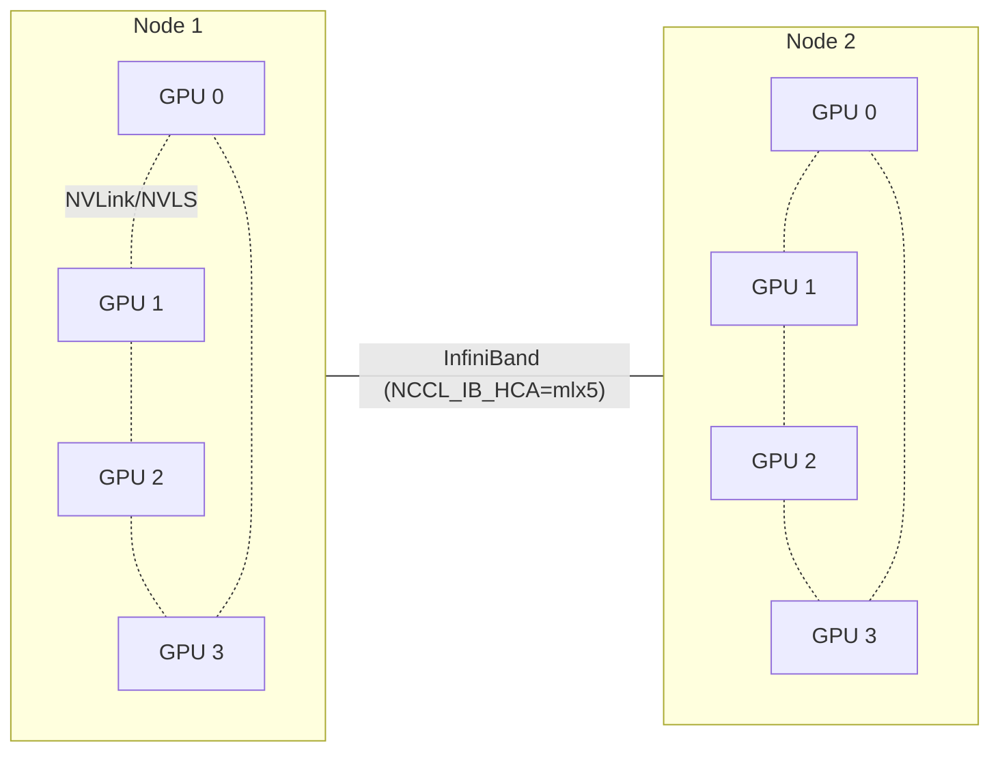

# Multi-GPU and multi-node

`llmc/zero.cuh` is based on `llm.c`'s multi-GPU layer. ZeRO-0/1/2/3 and the
NCCL init paths are wired. ZeRO-3 owns a local BF16 parameter shard, runs AdamW
on that shard, and all-gathers back into the existing full parameter layout used
by the current forward/backward kernels. NCCL operates on opaque device buffers;
ThunderKittens kernels write into those buffers. The two are independent.

Scalar NCCL collectives in the trainers and ZeRO helper code use NCCL element
counts, not byte sizes. Run `scripts/validate_goal_h100.sh source-guards` before
distributed validation to catch regressions such as passing `sizeof(float)` to
`ncclAllReduce` for a single-float buffer.
The same guard checks that parameter-shard `ncclAllGather` calls are ordered
after the AdamW update kernels on the compute stream. Without that event wait,
NCCL can read stale shards from `nccl_stream`.
It also checks the ZeRO-3 shard contract in both trainers: the authoritative
parameter-shard buffer, the shard-local AdamW update, and the compute-stream
ordered all-gather back into the full compute layout.

This page is for orientation. The current implementation details live in
`llmc/zero.cuh`.

## ZeRO levels

| Level | Sharded across ranks | Where it kicks in | Notes |
|---|---|---|---|
| 0 | nothing | always | All-reduce on gradients |
| 1 | optimizer state (`m`, `v`, master weights) | M4 + | Uses reduce-scatter for averaged gradient shards before the local update, matching llm.c's update path |
| 2 | + reduced gradient ownership | M5 | `-z 2` now uses the sharded optimizer/reduce-scatter path; backward still allocates full gradient accumulation buffers because kernels write the full parameter layout |
| 3 | + parameters | M5 | Runtime path is compile-wired with a local parameter shard plus all-gather into the full compute layout; full compute/gradient buffers are still allocated by the current kernels; H100/NCCL validation pending |

Llama-3 8B does **not** fit comfortably on 8×H100-80GB at ZeRO-1 (~96 GB
optimizer + params + grads before activations). M7's
`multi_node/run_llama3_8B_fs.sbatch` targets ZeRO-2 across two nodes. The code
path is compile-wired, but the real two-node H100/NCCL run remains pending.

## Build switches

The Makefile sniffs NCCL and OpenMPI at configure time. System NCCL installs
are detected through `ldconfig`/package metadata plus `nccl.h`; cluster or
module installs can be selected explicitly:

```
✓ NCCL found, multi-GPU enabled         # adds -DMULTI_GPU -lnccl
✓ MPI found                              # adds -DUSE_MPI -lmpi
```

For a custom NCCL prefix:

```bash
make NCCL_DIR=/path/to/nccl
make NCCL_INCLUDE_PATH=/path/to/include NCCL_LIB_PATH=/path/to/lib64
```

The H100 validation harness uses the same variables in its `preflight` phase,
so set them before `scripts/validate_goal_h100.sh` on module-based clusters.

To force-disable:

```bash
make NO_MULTI_GPU=1     # single-GPU build, no NCCL
make NO_USE_MPI=1       # NCCL-only build, no MPI (TCP/FS init still works)
```

If NCCL is missing the Makefile prints:

```
✗ NCCL not found, multi-GPU disabled
    install libnccl2/libnccl-dev or set NCCL_DIR/NCCL_INCLUDE_PATH/NCCL_LIB_PATH
```

## NCCL init paths

`zero.cuh` supports four init methods, selected at runtime via CLI flags
(`-pi <method>` etc., same as llm.c):

1. **Single-process, multi-GPU on one node** — process spawns N CUDA contexts.
2. **MPI** — OpenMPI launches one process per rank; rank/world come from
   `MPI_Comm_rank` / `MPI_Comm_size`. Used by `run_gpt2_124M_mpi.sh`.
3. **Filesystem rendezvous (FS)** — ranks discover each other through a
   shared file. Used by `*_fs.sbatch` Slurm scripts.
4. **TCP rendezvous** — ranks discover each other through a master TCP
   address. Used by `*_tcp.sbatch`.

All four are wired in upstream and require no changes to the kernels.

## H100-pod NCCL env vars

Add these to multi-node scripts (commented as "tune per pod"):

```bash
# H100 NVLink-SHARP — usually a measurable throughput gain on H100 pods
export NCCL_NVLS_ENABLE=1

# Adjust to match your fabric. mlx5 = Mellanox/NVIDIA InfiniBand HDR/NDR.
export NCCL_IB_HCA=mlx5

# These are llm.c's defaults; keep unless your pod requires otherwise.
export NCCL_NET_GDR_LEVEL=2
export NCCL_IB_DISABLE=0

# Fabric-specific (set per pod):
# export NCCL_SOCKET_IFNAME=...
# export NCCL_IB_GID_INDEX=...
```

These vary per pod. The plan's instruction is to **keep these prominently
documented in each multi-node script** rather than burying them in environment
files.

## Topology



## Per-script status

Same as the [build-and-run](build-and-run.md) target list; copied here for the
multi-node-specific scripts:

| Script | Status | Milestone |
|---|---|---|
| `scripts/run_gpt2_124M.sh` (8×H100, ZeRO-1) | ✅ ported; runtime pending | M4 |
| `scripts/run_gpt2_350M.sh` | ✅ ported; runtime pending | M4 |
| `scripts/run_gpt2_774M.sh` (`-ge 1` epilogue opt-in) | ✅ ported; runtime pending | M4 |
| `scripts/run_gpt2_1558M.sh` (`-ge 1` epilogue opt-in) | ✅ ported; runtime pending | M4 |
| `scripts/pyrun_gpt2_124M.sh` | ✅ ported; runtime pending | M4 |
| `scripts/run_gpt3_125M.sh` | ✅ ported; runtime pending | M5 |
| `scripts/multi_node/run_gpt2_124M_mpi.sh` | ✅ ported; runtime pending | M5 |
| `scripts/multi_node/run_gpt2_124M_fs.sbatch` | ✅ ported; runtime pending | M5 |
| `scripts/multi_node/run_gpt2_124M_tcp.sbatch` | ✅ ported; runtime pending | M5 |
| `scripts/run_llama3_1B.sh` | ✅ ported; trainer loop compile-wired; defaults to FineWeb-edu 100B; H100/TK GQA numerical validation pending | M6 |
| `scripts/multi_node/run_llama3_8B_fs.sbatch` (ZeRO-2 across 2 nodes) | ✅ ported; ZeRO-2 compile-wired; H100/NCCL/TK GQA numerical validation pending | M7 |

Step times scale roughly as 2.5× llm.c's A100 numbers (H100 SXM5 ≈ 2.5×
A100 throughput on bf16 dense matmul + flash-attn). The full table is in
[`../goal.md`](../goal.md#m4--multi-gpu-gpt-2-124m-reproduction--not-started).

## Verification

Multi-node sanity test (M5+): a 2-node `run_gpt2_124M_fs.sbatch` should produce
the same loss curve as the single-node 8×H100 run within the first 100 steps.
Larger drift implies a desync in the gradient all-reduce or master-weight
broadcast — usually a bad NCCL env var.
Before launching, run `scripts/validate_goal_h100.sh source-guards` so scalar
all-reduce counts, optimizer all-gather stream ordering, and ZeRO-3 parameter
shard wiring are checked without requiring a live NCCL job. Run
`scripts/validate_goal_h100.sh zero-guards` to validate host-only ZeRO-3 layouts
and assert that unsupported stages such as `-z 4` fail with the supported-stage
message, and that impossible GPT/Llama ZeRO-2 process counts fail with the
partitioning diagnostic. On H100/NCCL hosts, `scripts/validate_goal_h100.sh
zero3-smoke` runs a short GPT-2 `-z 3` training job and validates the resulting
rank-0 `main.log`.
