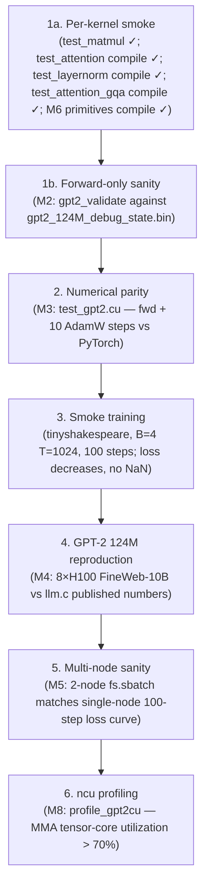

# Testing and verification

llm.kittens borrows llm.c's test pyramid. Today step 1a is live, and the
`train_gpt2cu` / `test_gpt2cu` compile paths are wired. Runtime forward/parity
checks still need H100 access and the starter-pack `.bin` files.

The executable checklist for a target H100 box is
[`../scripts/validate_goal_h100.sh`](../scripts/validate_goal_h100.sh). The full
phase catalogue, env-var list, threshold table, and validate-only recipes live
in [`validation-harness.md`](validation-harness.md); this section gives the
testing-pyramid summary.

With no arguments the harness runs the `goal-core` H100 gates: preflight, full compile,
launch-script and Python helper syntax checks, source-level CUDA/NCCL/ZeRO,
GQA/RoPE, BF16/Hopper+Blackwell/TK build, GELU-epilogue source, profile-gate source, Llama conversion source, rank-0 training-log evidence, launch-script, and runtime-marker contract guards, CUDA runtime/device-allocation probe, synthetic and prepared
GPT-2/Llama data artifact metadata checks, host-only C++
DataLoader/EvalLoader smoke, CPU-only GQA/RoPE PyTorch reference checks,
synthetic profile parser/threshold checks, synthetic training-log verifier
checks, synthetic captured-evidence replay checks, synthetic Llama converter
writer checks, starter-pack file, tokenizer, checkpoint metadata, and debug-state
payload checks, kernel smoke tests, GPT-2 forward/parity checks, GPT-2/GPT-3
and Llama descriptor dry-runs with host-only 8-process ZeRO layout validation,
host-only ZeRO-3 layout validation, standalone ZeRO shard offset coverage, and
ZeRO request guard checks.
It also writes and validates a tiny synthetic Llama checkpoint through the same
host-only parser and ZeRO-2 layout path used for converted HF checkpoints.
For local machines without a usable CUDA runtime, `scripts/validate_goal_h100.sh
host-core` runs the non-CUDA-runtime subset using existing built binaries and
artifacts.
The target preflight and CUDA runtime probe default to H100/sm90-class GPUs.
Blackwell hosts have separate paths:
`scripts/validate_goal_h100.sh blackwell-compile` builds model and smoke targets
for `DEVICE_ARCH=SM100|SM103|SM120`, while
`scripts/validate_goal_h100.sh blackwell-device` probes a datacenter Blackwell
runtime with `DEVICE_TEST_TARGET=blackwell` and `DEVICE_ARCH=SM100`. RTX 5090
hosts can run `scripts/validate_goal_h100.sh rtx5090-device`, which forces
`DEVICE_TEST_TARGET=rtx5090` and `DEVICE_ARCH=SM120`. These paths do not count
as runtime evidence for unchecked H100 `goal.md` performance/parity items;
`goal-complete` still requires H100 evidence.
Longer phases are explicit:

```bash
scripts/validate_goal_h100.sh host-core
scripts/validate_goal_h100.sh zero-guards
scripts/validate_goal_h100.sh script-syntax
scripts/validate_goal_h100.sh python-syntax
scripts/validate_goal_h100.sh source-guards
scripts/validate_goal_h100.sh data-artifacts
scripts/validate_goal_h100.sh dataloader-smoke
scripts/validate_goal_h100.sh gqa-reference
scripts/validate_goal_h100.sh gqa-runtime
scripts/validate_goal_h100.sh profile-parser
scripts/validate_goal_h100.sh llama-converter-smoke
scripts/validate_goal_h100.sh cuda-runtime
scripts/validate_goal_h100.sh blackwell-compile
scripts/validate_goal_h100.sh blackwell-device
scripts/validate_goal_h100.sh rtx5090-device
scripts/validate_goal_h100.sh starter-pack
scripts/validate_goal_h100.sh gpt-dry
scripts/validate_goal_h100.sh llama-dry
scripts/validate_goal_h100.sh llama-checkpoint-smoke
scripts/validate_goal_h100.sh profile
scripts/validate_goal_h100.sh gpt2-smoke
scripts/validate_goal_h100.sh llama-resume
scripts/validate_goal_h100.sh llama1b-stability
scripts/validate_goal_h100.sh gpt2-full
scripts/validate_goal_h100.sh llama1b-full
scripts/validate_goal_h100.sh llama8b-convert
scripts/validate_goal_h100.sh llama8b-full
scripts/validate_goal_h100.sh goal-complete
```

For a target machine where you intentionally want to prove every remaining
`goal.md` gate in one pass, use:

```bash
ALLOW_FULL_GOAL_RUN=1 scripts/validate_goal_h100.sh goal-complete
```

`goal-complete` runs `goal-core` and then the long
H100/NCCL/profile/conversion/full-run phases: GPT-2 smoke, ZeRO-3 GPT-2 smoke,
Llama resume, GQA runtime, Llama-3 1B stability, `ncu` profiling, GPT-2 124M
full reproduction, GPT-2 two-node loss-curve comparison, Llama-3 1B full run,
real gated HF Llama-3.1 8B conversion/validation, and the Llama-3 8B multi-node
Slurm run.
It is guarded by
`ALLOW_FULL_GOAL_RUN=1` so the default harness cannot accidentally launch
multi-hour jobs. It fail-fast checks `gpt2_124M_bf16.bin`, `ncu` for live or
`.ncu-rep` profile validation, and `sbatch` when the two-node/full 8B phases are
not in validate-only mode. In validate-only mode it checks the pre-existing
two-node reference/candidate logs, both `profile_ge0` and `profile_ge1` profile
artifacts, and 8B checkpoint/log artifacts before entering `goal-core`.
Use `scripts/validate_goal_h100.sh goal-complete-prereqs` to check those
completion prerequisites without launching `goal-core` or long jobs. It also
requires explicit smoke/full metric thresholds:
`GPT2_SMOKE_MAX_VAL_LOSS`, `ZERO3_SMOKE_MAX_VAL_LOSS`,
`LLAMA_RESUME_MAX_VAL_LOSS`, `LLAMA1B_STABILITY_MAX_VAL_LOSS`,
`LLAMA1B_STABILITY_MIN_HELLASWAG`, `GPT2_FULL_EXPECTED_VAL_LOSS`,
`GPT2_FULL_EXPECTED_HELLASWAG`, `GPT2_TWO_NODE_REL_TOL`,
`LLAMA1B_FULL_MAX_VAL_LOSS`,
`LLAMA1B_FULL_MIN_HELLASWAG`, `LLAMA8B_FULL_MAX_VAL_LOSS`, and
`LLAMA8B_FULL_MIN_HELLASWAG`. Optional `GPT2_FULL_METRIC_REL_TOL` controls the
GPT-2 published-metric tolerance. The prereq gate validates these values before
launch: loss and tolerance thresholds must be positive finite numbers, and
HellaSwag accuracy thresholds must be finite values in `[0,1]`.
The 8B Slurm phase uses `sbatch --wait` by default, then validates the captured
`run.log` launch metadata, final rank-0 checkpoint headers, and `main.log`; set
`LLAMA8B_FULL_VALIDATE_ONLY=1` to check an already completed
`LLAMA8B_FULL_OUT_DIR`.
Captured short-gate evidence can be replayed without launching CUDA jobs via
`PREFLIGHT_VALIDATE_ONLY=1`, `CUDA_RUNTIME_VALIDATE_ONLY=1`, `SMOKE_VALIDATE_ONLY=1`,
`GPT2_RUNTIME_VALIDATE_ONLY=1`, `GQA_RUNTIME_VALIDATE_ONLY=1`,
`GPT2_SMOKE_VALIDATE_ONLY=1`, `LLAMA_RESUME_VALIDATE_ONLY=1`, and
`LLAMA1B_STABILITY_VALIDATE_ONLY=1`; set the corresponding `*_LOG` variables
or output directories to the captured files.
Set `GPT2_FULL_VALIDATE_ONLY=1` or `LLAMA1B_FULL_VALIDATE_ONLY=1` to validate
existing GPT-2 124M or Llama-3 1B full-run `main.log`, `run.log`, and final
checkpoint evidence instead of relaunching those single-node full phases.
Set `LLAMA8B_CONVERT_VALIDATE_ONLY=1` to require and validate an existing
`LLAMA8B_CHECKPOINT` instead of attempting a gated HF conversion.

`GPT_DRY_CHECKPOINT=/path/to/model.bin scripts/validate_goal_h100.sh gpt-dry`
adds a host-only GPT checkpoint header and payload-size check to the descriptor
dry-runs. The built-in descriptor dry-runs and optional checkpoint branch
assert output text, including GPT-2 ZeRO-1/3 layout validation and descriptor
source, channel count, and ZeRO-2 layout markers for every built-in GPT-3
descriptor.
`python dev/validate_gpt2_starter_pack.py` is the host-only GPT-2 starter-pack
validator used by `starter-pack`; it checks the tokenizer, fp32/BF16 checkpoint
sizes, debug-state token ranges, expected loss, sampled logits/gradients, and
exact debug-state byte count before GPU model code runs. The `starter-pack`
phase first runs `--self-test` with tiny synthetic starter-pack artifacts, then
asserts the real metadata success marker and the follow-up GPT-2 ZeRO-1 dry-run
output.
`python dev/validate_nccl_source.py` is the source-level guard used by
`source-guards`; it checks `ncclAllReduce` calls in the trainer and ZeRO code
so scalar collectives use an element count such as `1`, not `sizeof(float)`.
It also checks that optimizer shard `ncclAllGather` calls are preceded by a
compute-stream to NCCL-stream event dependency, so all-gather reads updated
parameter shards after AdamW kernels have produced them.
The same guard checks the ZeRO-3 parameter-shard runtime contract in both
trainers: an authoritative local BF16 shard buffer, AdamW updates against the
owned shard, and an all-gather into the full parameter layout used by the
current compute kernels. It also checks that each trainer synchronizes after
the update-time parameter all-gather before subsequent full-layout reads. The
harness asserts the source-guard success marker.
`python dev/validate_zero_layout.py` is also part of `source-guards`; it checks
that GPT-2, every built-in GPT-3 descriptor, and Llama-3 1B/8B local ZeRO shard
intervals are divisible, non-overlapping, contiguous, and cover exactly
`total_params / nproc` for 1/2/4/8/16 processes.
`python dev/validate_build_contracts.py` is also part of `source-guards`; it
keeps the BF16/Hopper+Blackwell/TK build contract source-checked by asserting
the Makefile still builds with `sm_90a`, `sm_100a`, `sm_103a`, and `sm_120a`,
C++20, TK include paths, the matching `KITTENS_SM*` macro, and `ENABLE_BF16`,
while rejecting FP16/FP32 and cuBLAS/cuBLASLt/cuDNN link flags.
It also checks the BF16 `floatX` lock, the TK bridge static guards, 128-byte
alignment, dynamic shared-memory opt-in, and the intentionally empty
`cublas_common.h` shim.
`python dev/validate_epilogue_source.py` is also part of `source-guards`; it
keeps the opt-in GPT-2 MLP bias+GELU epilogue tied together across the TK GEMM
template, matmul wrapper, `train_gpt2.cu` `-ge` switch and fallback, larger GPT
launch scripts, and `test_matmul` smoke coverage.
`python dev/validate_gqa_source.py` is also part of `source-guards`; it locks
down the custom Llama GQA/RoPE contract by checking that tile-load RoPE is used
only for TK forward+backward-supported shapes, that query heads map to shared
KV heads through the expected ratio, that supported-shape TK backward receives
the RoPE tables and still inverse-rotates packed `dQ`/`dK` gradients afterward,
and that the T=128 fallback-backward, T=256 TK-backward, and CPU reference
paths remain wired.
`python dev/validate_runtime_markers.py` is also part of `source-guards`; it
checks that CUDA runtime, kernel-smoke, GPT-2 validation, and GQA runtime
success markers exist in the corresponding sources and are asserted by the H100
harness.
`python dev/validate_training_source.py` is also part of `source-guards`; it
checks that `llmc/logger.h` writes rank-0 `main.log` with the exact `tel`,
`eval`, and `trl/lr/norm` formats parsed by `dev/validate_training_log.py`,
that both trainers initialize the logger with the actual `resuming` state, and
that the smoke/full-run harness phases pass the expected final-step and
required-metric arguments into the log validator.
`python dev/validate_profile_source.py` is also part of `source-guards`; it
keeps the H100 profiling gate tied to `profile_gpt2cu.py`, the one-step
`profile_gpt2cu` binary, the Nsight Compute raw metric list, the tensor-core
utilization threshold, and the `PROFILE_MIN_TENSOR_UTIL` harness wiring.
`python dev/validate_llama_conversion_source.py` is also part of
`source-guards`; it keeps the real gated HF Llama-3.1 8B conversion gate tied
to the supported model alias, BF16 checkpoint header/size validation,
synthetic-checkpoint path, C++ dry-parse options, and the harness
`llama8b-convert` phase.
`python dev/validate_goal_harness_coverage.py` keeps the compile,
runtime-evidence, and `goal-complete` coverage contract honest by checking that
`phase_compile`, `goal-core`, the long H100 phases, every unchecked `goal.md`
runtime item, and the required explicit metric-threshold environment variables
stay wired. It also checks that the replay smoke retains the negative
`goal-complete-prereqs` evidence cases.
`python dev/validate_data_artifacts.py` is the host-only prepared-data validator
used by `data-artifacts`; it skips absent default datasets, validates exact
train/eval file sizes and magic/version pairs when files are present, samples
training token ranges, and parses the full HellaSwag-style eval stream. The
harness first runs its synthetic `--self-test` pass/fail path, then asserts the
real-file metadata success marker.
`make test_dataloader && ./test_dataloader` is the host-only C++ loader smoke
used by `dataloader-smoke`; it writes synthetic GPT-2/Llama train/eval files
under `/tmp` and loads them through `DataLoader` and `EvalLoader`. The harness
asserts the loader smoke success marker.
`python dev/validate_attention_gqa_reference.py` is the CPU-only GQA/RoPE
reference check used by `gqa-reference`; it compares materialized-RoPE
attention with repeated KV heads against a grouped/tile-load-style formulation
and checks backward gradients for `B=1 T=128` and `B=1 T=256`. The harness
asserts the final reference success marker.
`scripts/validate_goal_h100.sh gqa-runtime` runs that CPU reference check and
then executes `test_attention_gqa`, which is the H100 CUDA/TK comparison for the
same `B=1 T=128` and `B=1 T=256` smoke shapes. It asserts the per-shape
`GQA case T=128 backward=fallback OK` and `GQA case T=256 backward=tk OK`
markers plus the final `test_attention_gqa smoke OK` marker, so missing shape
coverage, CUDA launch failures, or numerical failures cannot be hidden by
partial output.
`scripts/validate_goal_h100.sh cuda-runtime` asserts the `CUDA runtime check
passed.` marker after the driver/runtime/device-allocation probe completes.
The probe independently enforces the same target contract as `preflight`:
H100 by default, datacenter Blackwell when `DEVICE_TEST_TARGET=blackwell` is
set, or RTX 5090 when `DEVICE_TEST_TARGET=rtx5090` is set. In Blackwell and
RTX 5090 validate-only modes the harness also requires the matching
`CUDA device target: ...` log marker.
`scripts/validate_goal_h100.sh smoke` asserts `<binary> smoke OK` from each
kernel smoke binary: `test_matmul`, `test_attention`, `test_layernorm`,
`test_rope`, `test_rmsnorm`, `test_swiglu`, and `test_attention_gqa`.
`scripts/validate_goal_h100.sh gpt2` asserts both `gpt2_validate OK` and
`test_gpt2cu OK`, so the M2/M3 runtime gates must reach their explicit final
success markers.
`python dev/validate_profile_parser.py` is the host-only profiling parser check
used by `profile-parser`; it feeds synthetic Nsight Compute raw CSV into
`profile_gpt2cu.py --csv-input` and asserts both passing and failing
tensor-utilization thresholds. The harness asserts the parser success marker.
`python dev/validate_log_tools.py` is the host-only training-log verifier check
used by `log-tools`; it feeds synthetic rank-0 logs through
`dev/validate_training_log.py` and `dev/compare_training_logs.py`, asserting
both passing and failing threshold, expected-metric tolerance, final-step,
loss-curve, and non-decreasing curve paths. The harness asserts the log-tool
success marker.
`python dev/validate_goal_replay.py` is the host-only captured-evidence replay
check used by `goal-replay-smoke`; it writes temporary preflight/runtime marker
logs, rank-0 `main.log` files, full-run launch metadata, two-node curve logs,
Llama checkpoint artifacts, profile CSVs for both GELU modes, and a synthetic
Llama checkpoint, then runs the harness validate-only branches and
`goal-complete-prereqs` against them. It also asserts negative prereq replay
cases for `ALLOW_NON_H100`, missing explicit thresholds, missing GQA runtime
markers, missing ZeRO-3 smoke stage evidence, missing GPT-2 full-run launch
evidence, missing fused profile evidence, and missing profile CSV evidence. The
harness asserts the replay success marker.
`python dev/validate_llama3_converter.py --cpp-validate --train-binary
./train_llama3cu` is the host-only Llama converter writer check used by
`llama-converter-smoke`; it builds a tiny `LLaMA` model, fills each named
parameter with a distinct BF16 value, runs `train_llama3.py::write_model`, checks
the header and payload tensor order, then dry-parses the file with
`train_llama3cu -x 0 -z 2`. The harness asserts the converter success marker so
a later unrelated dry-run failure cannot be mistaken for this check passing.
`LLAMA_DRY_CHECKPOINT=/path/to/llama.bin scripts/validate_goal_h100.sh
llama-dry` adds the same host-only C++ checkpoint parser and payload-size check
for converted Llama checkpoints; it defaults to ZeRO-2 layout validation and
can be overridden with `LLAMA_DRY_ZERO_STAGE`. The Llama dry-run goes through
the same `set_zero_configs` helper as runtime, so the printed local shard
parameter count is part of the checked contract. The built-in Llama dry-runs
assert descriptor and ZeRO layout text for `llama3:1B`, `llama3:8B`, and
`llama3.1:8B`; the optional checkpoint branch also asserts the selected ZeRO
layout or parser success marker.
`dev/download_llama3.py --cpp-validate` accepts `--cpp-zero-stage` and
`--cpp-processes`, so real gated HF conversions and synthetic checkpoints can
run the C++ parser through the same ZeRO layout dry-run without a second manual
command.
`scripts/validate_goal_h100.sh zero-guards` checks that host-only `-x 0 -z 3`
GPT/Llama layout validation succeeds. The negative cases assert that
unsupported stages such as `-z 4` fail with the explicit supported-stage
message instead of falling through to a later error. It also checks impossible
process counts for GPT and Llama ZeRO-2 layouts, so non-divisible parameter
shards fail with the intended partitioning diagnostic.
`scripts/validate_goal_h100.sh llama-checkpoint-smoke` is the repeatable local
version: it uses `dev/download_llama3.py --write-synthetic-checkpoint` to write
a tiny BF16 Llama checkpoint under `/tmp`, runs `--cpp-validate`, then checks
the ZeRO layout with `train_llama3cu -x 0`.
`scripts/validate_goal_h100.sh llama8b-convert` is the real gated HF conversion
gate. If `LLAMA8B_CHECKPOINT` exists, it validates that file with
`dev/download_llama3.py --validate-only --cpp-validate`; otherwise it converts
`${LLAMA8B_MODEL:-llama3.1:8B}` into `${LLAMA8B_OUTPUT_DIR:-.}` and runs the
same C++ dry parser. The default dry-run layout is ZeRO-2 across 16 processes,
matching the 2-node 8×H100 M7 target.
`scripts/validate_goal_h100.sh gpt2-two-node` runs the filesystem Slurm script
with `sbatch --wait` and `MAX_STEPS=100` by default, then compares the first
100 train-loss steps from a single-node/reference `main.log` and the
two-node/candidate `main.log`. It uses `dev/compare_training_logs.py`, requires
`GPT2_TWO_NODE_REL_TOL`, requires both compared train-loss curves to decrease
over the selected window, and defaults the reference log to the GPT-2 full-run
output. Set `GPT2_TWO_NODE_VALIDATE_ONLY=1` to compare existing logs.
`scripts/validate_goal_h100.sh llama8b-full` runs the 2-node Slurm script with
`sbatch --wait` unless `LLAMA8B_FULL_VALIDATE_ONLY=1` is set. After the job, it
validates the captured `run.log` launch metadata, final `DONE_*`, model, and
rank-0 state headers with `dev/validate_llama_checkpoint_artifacts.py`, then
checks final validation, HellaSwag/eval, train metrics, and train-loss decrease
in `main.log`.
`python dev/validate_training_log.py` is the rank-0 `main.log` evidence checker
used after GPT-2 smoke, Llama resume, and long training phases. It parses
`s:<step> tel:<loss>` validation
loss lines, `s:<step> eval:<accuracy>` HellaSwag/eval lines, and
`s:<step> trl:<loss> lr:<lr> norm:<grad_norm>` train lines. The
`gpt2-smoke`, `llama-resume`, `llama1b-stability`, `gpt2-full`, and
`llama1b-full` phases fail if the
expected final metric steps are missing, non-finite, outside the requested
published/threshold values, or if required train loss does not decrease.
`gpt2-smoke` uses the same verifier after the tiny-shakespeare run, requiring
final train/validation metrics and train-loss decrease before the smoke gate
passes. `llama-resume` also verifies the first and resumed checkpoint artifacts
with `dev/validate_llama_checkpoint_artifacts.py` plus final train/validation
metrics after the restart, so the checkpoint smoke must leave both parseable
checkpoint files and metric evidence.

Use `MAKE_EXTRA="NO_MULTI_GPU=1 NO_USE_MPI=1"` only for compile/debug hosts.
For goal completion on H100, leave multi-GPU enabled and install NCCL/MPI.

## The pyramid



## Step 1a — per-kernel smoke

Live today:

- [`dev/cuda/test_matmul.cu`](../dev/cuda/test_matmul.cu) → `make test_matmul`.
  It covers TK forward GEMM dispatch, the opt-in forward bias+GELU epilogue,
  plus both dWeight `A^T*B` paths: overwrite and accumulated `+=` via the
  scratch-backed TK path.
- [`dev/cuda/test_attention.cu`](../dev/cuda/test_attention.cu) →
  `make test_attention`. It covers GPT-style packed Q/K/V unpacking, causal MHA
  forward, and packed Q/K/V gradients against an independent CPU reference. The
  `T=192` case covers direct TK forward plus CUDA fallback backward; the `T=256`
  case covers padded TK forward plus supported-shape TK backward. Runtime
  execution still needs a compatible H100 driver/runtime.
- [`dev/cuda/test_layernorm.cu`](../dev/cuda/test_layernorm.cu) →
  `make test_layernorm`. It covers GPT-style LayerNorm forward, fused
  residual+LayerNorm forward, saved `mean`/`rstd`, and backward `+=`
  accumulation into `dinp`, `dweight`, and `dbias` against independent CPU
  references. Runtime execution still needs a compatible H100 driver/runtime.
- [`dev/cuda/test_attention_gqa.cu`](../dev/cuda/test_attention_gqa.cu) →
  `make test_attention_gqa`. It covers Llama packed Q/K/V unpacking, RoPE,
  GQA causal forward, and packed backward gradients against an independent CPU
  reference. The `T=128` case covers TK forward plus CUDA fallback backward; the
  `T=256` case covers supported-shape TK backward and the tile-load RoPE path.
  Runtime execution still needs a compatible H100 driver/runtime.
- [`dev/cuda/test_rope.cu`](../dev/cuda/test_rope.cu) → `make test_rope`.
  It covers HS=64 and HS=128 RoPE forward plus inverse-rotation backward
  against an independent CPU reference.
- [`dev/cuda/test_rmsnorm.cu`](../dev/cuda/test_rmsnorm.cu) →
  `make test_rmsnorm`. It covers RMSNorm forward, fused-residual forward,
  saved `rstd`, `dinp`, and `dweight` against independent CPU references.
- [`dev/cuda/test_swiglu.cu`](../dev/cuda/test_swiglu.cu) →
  `make test_swiglu`. It covers SwiGLU forward, `dgate`, and `dup` against an
  independent CPU reference.
- [`dev/cuda/test_gelu.cu`](../dev/cuda/test_gelu.cu) → `make test_gelu`.
  Forward and in-place backward tanh-approximation GELU.
- [`dev/cuda/test_fused_classifier.cu`](../dev/cuda/test_fused_classifier.cu) →
  `make test_fused_classifier`. Loss + dlogits via stable log-softmax over the
  unaligned-vocab path (`V=1003`, `P=1024`).
- [`dev/cuda/test_encoder.cu`](../dev/cuda/test_encoder.cu) → `make test_encoder`.
  Token + position embedding forward (gather-add). Backward is exercised in the
  whole-model parity gate because of stochastic-rounding nondeterminism.
- [`dev/cuda/test_adamw.cu`](../dev/cuda/test_adamw.cu) → `make test_adamw`.
  One AdamW step; FP32 `master_params`/`m`/`v` checked bit-close (1e-5) and the
  bf16 `params` write within one stochastic-rounding ULP.
- [`dev/cuda/test_global_norm.cu`](../dev/cuda/test_global_norm.cu) →
  `make test_global_norm`. Sum-of-squares across two parameter shards followed
  by the aggregate kernel, compared to a CPU reduction.

`make all` also compile-checks `train_gpt2cu` and `test_gpt2cu`. The aggregate
target `make -j test-kernels` builds all twelve smoke binaries in one go.

### Per-kernel pytest harness (USE_RUNPOD_FLASH)

The smokes above are also driven by a `pytest` layer under `tests/kernels/`.
Each test wraps one binary, asserts `exit==0` and `<name> smoke OK` in stdout,
and writes `<name>.log` to the repo root for the bash harness's
`SMOKE_VALIDATE_ONLY` replay path.

Run on the attached GPU (uses whatever `DEVICE_ARCH` you've exported, default
`SM90`):

```bash
pytest tests/kernels/ -v
DEVICE_ARCH=SM120 pytest tests/kernels/ -v   # local Blackwell box
```

Run on a remote H100 via runpod-flash (single warm worker, builds once):

```bash
USE_RUNPOD_FLASH=1 pytest tests/kernels/ -v
```

The flash backend lives in [`tests/runners/flash.py`](../tests/runners/flash.py)
and uses one `Endpoint(gpu=GpuGroup.ADA_80_PRO, workers=1, idle_timeout=600)`.
First call ships a tar.gz of the source tree (~few MB; data and `.bin` files
are excluded), runs `make -j test-kernels` on the worker, then re-uses the
warm container for subsequent test executions. The worker idle-scales down ~10
minutes after the last test.

A thin convenience wrapper [`scripts/validate_kernels.sh`](../scripts/validate_kernels.sh)
runs `pytest tests/kernels --junitxml=.pytest_junit.xml` for CI. Pass
`USE_RUNPOD_FLASH=1` through the environment to dispatch remotely. Pass
`--parity` to switch to the parity tier described below.

### Per-kernel parity (tests/parity/)

The parity tier complements the CPU-reference smoke with a stronger check:
each TK kernel is run side-by-side against an **independent authoritative
implementation** of the same op, on the same H100, with identical bf16
inputs. This catches regressions where the TK kernel and a hand-written CPU
reference happen to drift in the same direction (e.g. a shared off-by-one
indexing convention).

Two test families:

- **Family A (llm.c parity)** — for kernels ported directly from llm.c
  (`/mnt/disk2/home/adam/dev/open-source/llm.c`). Two probe binaries are
  built per kernel (`probe_<name>_ref` and `probe_<name>_tk`) — each
  consumes the same `.npy` inputs and writes its outputs to its own subdir.
  The pytest layer diffs them. Currently implemented: `layernorm`, `gelu`,
  `encoder`, `global_norm`. (Pending: `matmul` — needs cuBLASLt init in
  the ref probe; `attention`, `attention_backward`, `adamw`, and
  `fused_classifier` — straightforward extensions of the same probe pattern.)
- **Family B (PyTorch parity)** — for kernels with no llm.c counterpart
  (Llama-3-specific). One TK probe binary; the reference is computed in
  PyTorch on the Python side. Currently implemented: `swiglu`. (Pending:
  `rmsnorm`, `rope`, `attention_gqa`.)

Inputs cross the Python/CUDA boundary as `.npy` files. Because NumPy has no
native bf16, we carry bf16 as `uint16` raw bits — the probe binaries
reinterpret as `__nv_bfloat16` on the device. The npy I/O is handled by a
small vendored header at [`dev/third_party/npy/npy.h`](../dev/third_party/npy/npy.h).

Three execution targets, each with the same test code:

| Target | How to invoke | What it actually exercises |
|---|---|---|
| Local **SM120** (RTX 5090) | `scripts/validate_kernels.sh --parity --sm120` | TK fast paths fall back to plain CUDA kernels identical to llm.c's, so Family A tests pass bit-exact. Validates the harness plumbing (probe build, .npy roundtrip, max_abs_diff), not the Hopper fast paths. |
| Local **SM90** (H100 dev box, if you have one) | `scripts/validate_kernels.sh --parity` | Real parity check — TK kernels exercise WGMMA/TMA. |
| Remote **H100** via runpod-flash | `USE_RUNPOD_FLASH=1 scripts/validate_kernels.sh --parity` | Same as local SM90 but via the flash worker. **The authoritative gate.** |

Equivalent raw-pytest invocations:

```bash
DEVICE_ARCH=SM120 pytest tests/parity/ -v
USE_RUNPOD_FLASH=1 pytest tests/parity/ -v -s   # -s shows live flash progress
```

#### Flash setup and smoke test

Configure runpod-flash auth one of two ways:

```bash
export RUNPOD_API_KEY=<your_key>     # env var
flash login                          # or browser OAuth — writes ~/.config/runpod/
```

The harness does not validate auth itself; if neither is set, the SDK will
surface its own error. Run the smoke test below first to confirm everything's
wired up before paying for the larger parity build.

To verify flash itself works end-to-end before tying that signal to our
build pipeline, run the standalone CUDA `1 + 1` smoke test:

```bash
python dev/flash_smoke.py
```

It takes ~1-2 min on the first call (cold start dominates), prints a
heartbeat every 10 s while waiting, dispatches a tiny `add<<<1,1>>>` kernel
to the same GPU group the parity tests use (`ADA_80_PRO`), and prints
`{'sum': 2, 'gpu': 'NVIDIA H100 ...', 'step': 'ok'}` on success. If this
fails, the parity tests can't possibly work — fix the underlying flash
issue first.

#### Live progress while waiting

The `_remote()` await is opaque to us (the SDK could be cold-starting,
apt-installing, building 30+ kernels, or stuck on a network call). The
harness emits a heartbeat to stderr every 15 s during bootstrap and every
10 s during per-test dispatch, e.g.:

```
[flash 14:23:01] dispatching bootstrap to H100 worker. Stages on first call:
[flash 14:23:01]   1. cold-start H100 (~30-90s)
[flash 14:23:01]   2. apt install build-essential (~10-30s, cached on warm worker)
[flash 14:23:01]   3. extract tarball (~1s)
[flash 14:23:01]   4. make -j test-kernels parity-kernels (~3-8 min, 30+ nvcc binaries)
[flash 14:23:16]   ... bootstrap still waiting (15s elapsed)
[flash 14:23:31]   ... bootstrap still waiting (30s elapsed)
[flash 14:25:42] bootstrap returned in 161.3s, build_rc=0
[flash 14:25:42] dispatching probe_layernorm_ref /tmp/.../iodir_0...
[flash 14:25:51]   probe_layernorm_ref returned in 8.9s (exit=0)
```

Run with `pytest -s` (or `scripts/validate_kernels.sh --parity`) to see
those lines live.

The **authoritative gate** is the H100 dispatch:

```bash
USE_RUNPOD_FLASH=1 pytest tests/parity/ -v
```

The flash backend ([`tests/runners/flash.py`](../tests/runners/flash.py))
bundles three sibling source trees — `llm.kittens`, `../ThunderKittens`,
`../llm.c` — into one ~2 MB tar.gz, ships it once on session start, runs
`make -j test-kernels parity-kernels` on the H100 worker, then re-uses the
warm container for each probe call. Per-test `.npy` inputs are tarred into
the call payload; outputs come back the same way. The Endpoint declares
`dependencies=["torch", "numpy"]` and
`system_dependencies=["build-essential", "libcublas-dev"]`.

To run only the parity tier from CI:

```bash
scripts/validate_kernels.sh --parity                    # local
USE_RUNPOD_FLASH=1 scripts/validate_kernels.sh --parity # remote H100
```

`test_matmul` exercises three default forward shapes, the opt-in forward
bias+GELU epilogue, plus the two dWeight cases:

| Shape | Why |
|---|---|
| `1024×1024×1024` square | exercises the default `matmul_template<2,4,8>` |
| `4096×3072×768` | GPT-2 124M MLP up-projection (default kernel) |
| `4096×50304×768` | GPT-2 124M LM head (`small_n` fallback, `OC % 256 != 0`) |
| `1024×4096×1024` bias+GELU | opt-in TK finish-path epilogue, including pre-GELU auxiliary output |
| `1024×1024×1024` dWeight overwrite | TK `A^T*B` into an empty gradient buffer |
| `1024×1024×1024` dWeight accumulate | TK `A^T*B` into scratch, then `dweight += scratch` |

Tolerance: `0.5` max abs diff against a naive bf16 reference with FP32
accumulation. Justification: bf16 has ~3e-3 relative precision; for K=768
with values in `[-1, 1]` the accumulation error is `~sqrt(K)*eps ~ 0.08`. The
0.5 bound has slack.

All smoke targets listed above have direct Makefile entries; H100 runtime
execution is still blocked in this local environment by the CUDA driver/runtime
mismatch.

Pattern (follow `test_matmul.cu`):

1. Allocate device buffers. Fill A/B with bf16 randoms.
2. Call the wrapper.
3. Run a naive reference kernel (bf16 inputs, fp32 accumulation).
4. Copy back, compute max abs diff, compare to a hand-derived tolerance.

## Step 1b — forward-only sanity (M2 gate)

`make gpt2_validate && ./gpt2_validate` should produce a sane forward loss on
`gpt2_124M_debug_state.bin`. This is purely a forward-path check: the binary
loads the debug-state batch, calls `gpt2_validate()`, compares the mean loss to
the PyTorch-saved reference loss, and exits before backward or AdamW. The target
compiles locally, but runtime is still pending on H100 because this workspace's
CUDA driver is older than the CUDA runtime.

## Step 2 — numerical parity (M3 gate)

`test_gpt2.cu` (ported from `llm.c/test_gpt2.cu`):

1. Load `gpt2_124M_debug_state.bin` (fetched by `dev/download_starter_pack.sh`).
2. Run a forward + backward pass.
3. Run 10 AdamW steps.
4. Compare every captured tensor (logits, dlogits, dW per layer, optimizer
   state) against the PyTorch reference.

### Loosened tolerances

llm.c tunes per-tensor tolerances against cuDNN flash-attn. TK MHA uses a
different reduction order, so attention-bwd tensors may need looser bounds
after the first H100 parity run. `test_gpt2.cu` now carries an explicit
`kGradientTolerances` table with tensor names, inherited llm.c BF16 thresholds,
current TK thresholds, and notes for likely MHA-bwd-sensitive tensors.

If parity is off by more than the table allows, the bug is structural — chase it
before relaxing further. If a real H100 run shows expected TK reduction-order
drift, update only the affected table row and keep the inherited llm.c threshold
visible for comparison.

## Step 3 — smoke training

The long GPT-2 and Llama launch scripts pass their configured `MAX_STEPS` into
the trainer with `-x` and derive their `DONE_*` guard from the same value; the
PyTorch GPT-2 reference script passes the same override to `--num_iterations`.
This keeps bounded runs and harness final-step log checks aligned with the run
that was actually launched. `dev/validate_launch_scripts.py` is part of
`source-guards` and checks those script contracts without launching a job.

```bash
./train_gpt2cu \
    -i dev/data/tinyshakespeare/tiny_shakespeare_train.bin \
    -j dev/data/tinyshakespeare/tiny_shakespeare_val.bin \
    -e gpt2_124M_bf16.bin \
    -b 4 -t 1024 -x 100 -v 20 -s 0
```

Pass criteria: loss strictly decreases over the 100 steps; no NaN/Inf in
weights, gradients, optimizer state, or loss; sample text at step 100 is
recognisably English. `scripts/validate_goal_h100.sh gpt2-smoke` checks
`log_goal_gpt2_smoke/main.log` after the run, requiring final validation and
train metrics plus train-loss decrease. `GPT2_SMOKE_MAX_VAL_LOSS` can add a
hard final validation-loss ceiling for a target H100 environment.
`zero3-smoke` uses the same rank-0 log verifier for the ZeRO-3 GPT-2 runtime
smoke and `goal-complete` requires `ZERO3_SMOKE_MAX_VAL_LOSS` for its final
validation-loss ceiling.

## Step 4 — GPT-2 124M reproduction (M4 gate)

8×H100, full `scripts/run_gpt2_124M.sh`. ZeRO-1, B=64, T=1024, 18,865 steps,
FineWeb-10B.

Pass criteria: final HellaSwag accuracy and val loss within 0.5% of llm.c's
published numbers. `scripts/validate_goal_h100.sh gpt2-full` checks the
rank-0 `main.log` final `tel` and `eval` entries, `run.log` launch metadata,
and final checkpoint marker/artifacts at step 18,865. For
`goal-complete`, set `GPT2_FULL_EXPECTED_VAL_LOSS` and
`GPT2_FULL_EXPECTED_HELLASWAG`; `GPT2_FULL_METRIC_REL_TOL` defaults to 0.5%.

## Step 5 — multi-node sanity (M5 gate)

2-node `scripts/multi_node/run_gpt2_124M_fs.sbatch`: same loss curve as the
single-node 8×H100 run within the first 100 steps. Larger drift implies a
desync in the gradient all-reduce or master-weight broadcast — usually a bad
NCCL env var (see [multi-gpu.md](multi-gpu.md)).

## Step 6 — Llama-3 1B (M6 gate)

8×H100, 1000 steps of the Llama-3 1B target on FineWeb-edu-100B.
Forward/backward stable; GQA numerics match the reference harness and a
PyTorch comparison on the `B=1 T=128` and `B=1 T=256` smoke shapes.
`dev/validate_attention_gqa_reference.py` covers the CPU-only PyTorch
equivalence for those shapes; `scripts/validate_goal_h100.sh gqa-runtime` is the
dedicated CUDA/TK smoke gate, and the training path still needs H100.
Use `scripts/validate_goal_h100.sh llama1b-stability` for the bounded 1000-step
FineWeb-edu run; it defaults to `dev/data/edu_fineweb100B/edu_fineweb_*.bin`
and requires `hellaswag_val_llama3.bin` unless `LLAMA1B_STABILITY_HELLASWAG=0`.
The phase verifies `log_goal_llama1b_stability/main.log` with
`dev/validate_training_log.py`, requiring final validation and train metrics,
train-loss decrease, and final HellaSwag/eval metrics when HellaSwag is
enabled. Setting `LLAMA1B_STABILITY_MIN_HELLASWAG` also requires final-step eval
evidence even if a debug replay sets `LLAMA1B_STABILITY_HELLASWAG=0`, and
`goal-complete` forces HellaSwag on before launching this phase. Optional
thresholds are `LLAMA1B_STABILITY_MAX_VAL_LOSS` and
`LLAMA1B_STABILITY_MIN_HELLASWAG`; the full-run phase uses
`LLAMA1B_FULL_MAX_VAL_LOSS` and `LLAMA1B_FULL_MIN_HELLASWAG`, and also
requires `run.log` launch metadata plus final checkpoint evidence.
Also cover a short checkpoint/restart run with `-n` and `-y 1` so the
optimizer, RNG, and dataloader state path is validated outside compile-only
checks. `scripts/validate_goal_h100.sh llama-resume` verifies
`DONE_00000001`, `model_00000001.bin`, `state_00000001_00000.bin`, the
matching final-step checkpoint files, and `log_goal_llama_resume/main.log`
after the resumed run. `dev/validate_llama_checkpoint_artifacts.py` parses the
model/state headers and checks magic, version, step, rank, and process count;
`scripts/validate_goal_h100.sh llama-checkpoint-smoke` also runs its synthetic
`--self-test` pass/fail path without requiring a trainer run.
`LLAMA_RESUME_MAX_VAL_LOSS` can add a target-host validation-loss ceiling.

## Step 7 — profiling (M8 polish)

```bash
make profile_gpt2cu
python profile_gpt2cu.py --min-tensor-util 70
python profile_gpt2cu.py --min-tensor-util 70 --gelu-fusion 1 --output profile_ge1
```

`profile_gpt2cu.py` runs `ncu --set full --import-source yes -o profile -f
./profile_gpt2cu --gelu-fusion N`, exports the raw metrics, and fails if average MMA
tensor-core utilization is below the requested threshold. To summarize an
existing report without rerunning Nsight Compute:

```bash
python profile_gpt2cu.py --skip-build --skip-run --report profile.ncu-rep
python profile_gpt2cu.py --csv-input profile.raw.csv --min-tensor-util 70
```

The harness path mirrors that existing-report mode:

```bash
PROFILE_VALIDATE_ONLY=1 PROFILE_CSV_DIR=. scripts/validate_goal_h100.sh profile
PROFILE_VALIDATE_ONLY=1 PROFILE_REPORT_DIR=. scripts/validate_goal_h100.sh profile
```

Use `PROFILE_CSV_DIR` when the raw `profile_ge*.csv` exports already exist and
the validation host does not have `ncu`. Use `PROFILE_REPORT_DIR` for
`profile_ge*.ncu-rep` files on a host that has `ncu`, since the helper still
uses Nsight Compute to export raw CSV from those reports.

Expect MMA tensor-core utilization > 70% on H100 for the GEMM-heavy ops. Lower
than that on attention is acceptable (TK MHA is bound by softmax /
softmax-bwd, not MMA).

`profile_gpt2.cu` and `profile_gpt2cu.py` are both in the tree. The remaining
M8 gate is the real H100 `ncu` run and post-processing output. The CSV parser
and utilization threshold path are covered by `dev/validate_profile_parser.py`.
The GPT-2 MLP up-projection bias+GELU epilogue is compile-wired behind `-ge 1`
and protected by `dev/validate_epilogue_source.py`; the H100 `profile` phase now
runs both `PROFILE_GELU_FUSIONS="0 1"` unless overridden. `goal-complete`
always forces/requires both `profile_ge0` and `profile_ge1` evidence, even if a
standalone `profile` debug run narrows `PROFILE_GELU_FUSIONS`.
