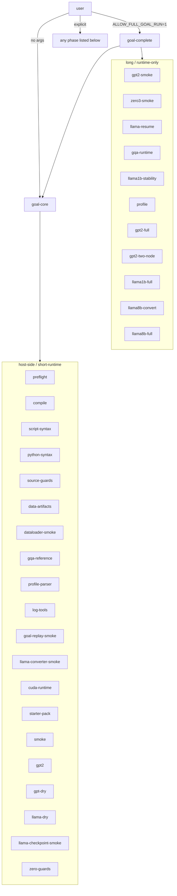

# Validation harness reference

[`scripts/validate_goal_h100.sh`](../scripts/validate_goal_h100.sh) is the
executable checklist for the runtime gates still open in
[`../goal.md`](../goal.md). This page is the single reference for its phases,
environment variables, and validate-only modes.

For the broader test pyramid see [`testing.md`](testing.md). For build flags
see [`build-and-run.md`](build-and-run.md). For trainer CLI flags see
[`cli-reference.md`](cli-reference.md).

## How to run

```bash
scripts/validate_goal_h100.sh                     # default = goal-core
scripts/validate_goal_h100.sh <phase> [<phase>…]  # run specific phases
scripts/validate_goal_h100.sh help                # full env-var listing
```

Phases are composable: `goal-core` runs the H100 host-side gates plus short
runtime gates; `goal-complete` extends to long-running training, profiling,
and conversion phases (and is gated by `ALLOW_FULL_GOAL_RUN=1`).



`host-core` (alias `all-local`) is `goal-core` minus the CUDA-runtime probes;
it is the one to use on a build host without H100 access.
`goal-complete-prereqs` runs the threshold/tooling/validate-only checks
that `goal-complete` enforces before launching anything.

## Phase catalogue

Phases are listed roughly in the order `goal-core`/`goal-complete` invoke
them. Every runtime phase asserts an explicit success marker so partial
output cannot pass the gate.

### Host-side / short-runtime

| Phase | What it does | Success marker(s) |
|---|---|---|
| `preflight` | Checks H100/sm90-class GPU, datacenter Blackwell, or `rtx5090` target, CUDA toolkit, NCCL, MPI. | `Preflight OK` |
| `compile` | Builds every compile-ready target: `test_*`, `train_*cu`, `gpt2_validate`, `profile_gpt2cu`, `cuda_runtime_check`, `test_dataloader`. | nvcc/c++ exit 0 |
| `script-syntax` | `bash -n` of every launch and data script. | per-script clean exit |
| `python-syntax` | `python3 -m py_compile` of every helper. | per-module clean exit |
| `source-guards` | Runs the 11 host-only source-contract guards under `dev/validate_*_source.py` plus `validate_zero_layout.py`. | each prints `… source guards OK` / `ZeRO shard layout validation OK` |
| `data-artifacts` | `validate_data_artifacts.py --self-test` then real-file metadata pass. | `Data artifact self-test OK`, `Data artifact metadata OK` |
| `dataloader-smoke` | Runs `./test_dataloader` against synthetic GPT/Llama train/eval files. | `DataLoader/EvalLoader smoke OK` |
| `gqa-reference` | CPU-only PyTorch GQA/RoPE equivalence check at `B=1 T=128/256`. | `GQA reference validation OK` |
| `profile-parser` | Synthetic Nsight Compute CSV through the parser/threshold path. | `profile parser OK` |
| `log-tools` | Synthetic `main.log` through `validate_training_log.py` and `compare_training_logs.py`. | `log tools OK` |
| `goal-replay-smoke` | Synthetic captured-evidence replay covering negative prereq cases. | `goal replay smoke OK` |
| `llama-converter-smoke` | Tiny `LLaMA` model → `write_model` → header/payload check → `train_llama3cu -x 0 -z 2`. | `Llama converter smoke OK` |
| `cuda-runtime` | Driver/runtime/device-allocation probe. Re-asserts target contract (H100, Blackwell, or rtx5090). | `CUDA runtime check passed.` |
| `blackwell-compile` | Builds model and smoke targets for `DEVICE_ARCH=SM100`, `SM103`, or `SM120` with NCCL/MPI disabled by default. | nvcc exit 0 |
| `device-tests`, `device-compile`, `blackwell-device`, `rtx5090-device` | Blackwell/RTX generic CUDA probes (CUDA runtime + plain CUDA SwiGLU smoke). Not goal-completion evidence. | `CUDA device target: blackwell` or `rtx5090`, `test_swiglu smoke OK` |
| `starter-pack` | `validate_gpt2_starter_pack.py --self-test` plus real artifact check; then a GPT-2 ZeRO-1 dry run. | starter-pack metadata OK marker |
| `smoke` | Runs `test_matmul`, `test_attention`, `test_layernorm`, `test_rope`, `test_rmsnorm`, `test_swiglu`, `test_attention_gqa`. | `<binary> smoke OK` from each |
| `gpt2` | `gpt2_validate` then `test_gpt2cu`. | `gpt2_validate OK`, `test_gpt2cu OK` |
| `gpt-dry` | Host-only `train_gpt2cu -x 0` for GPT-2 + each built-in GPT-3 descriptor; ZeRO-1/2/3 layout validation. | descriptor + ZeRO layout markers |
| `llama-dry` | Host-only `train_llama3cu -x 0` for Llama-3 1B/8B + 3.1:8B; optional checkpoint via `LLAMA_DRY_CHECKPOINT`. | descriptor + ZeRO layout markers |
| `llama-checkpoint-smoke` | `download_llama3.py --write-synthetic-checkpoint` + `--cpp-validate` + ZeRO layout dry-run. | `Llama checkpoint smoke OK` |
| `zero-guards` | Host-only `-x 0 -z 3` GPT/Llama layouts + negative cases for unsupported stages and impossible process counts. | `ZeRO request guards OK` |

### Long / runtime-only

| Phase | What it does | Required H100 / NCCL? | Notes |
|---|---|---|---|
| `gpt2-smoke` | Tiny-Shakespeare `train_gpt2cu` smoke; `validate_training_log.py` checks final train/val and decrease. | yes | Needs `GPT2_SMOKE_*`. |
| `zero3-smoke` | Short GPT-2 `-z 3` runtime smoke; same log validator. | yes | Needs `ZERO3_SMOKE_*`. |
| `llama-resume` | Llama checkpoint/resume: writes initial + final `model_*.bin`/`state_*_*.bin`/`DONE_*`, then `-y 1`. Validated with `validate_llama_checkpoint_artifacts.py` and `validate_training_log.py`. | yes | Needs `LLAMA_RESUME_*`. |
| `gqa-runtime` | `gqa-reference` then `./test_attention_gqa`. | yes | Asserts `GQA case T=128 backward=fallback OK`, `GQA case T=256 backward=tk OK`, `test_attention_gqa smoke OK`. |
| `llama1b-stability` | Bounded 1000-step Llama-3 1B FineWeb-edu run + log validation; HellaSwag forced on under `goal-complete`. | yes | `LLAMA1B_STABILITY_*` thresholds. |
| `profile` | Builds and runs `profile_gpt2cu` through `profile_gpt2cu.py`; defaults to `PROFILE_GELU_FUSIONS="0 1"`; fails below 70% MMA tensor-core utilization. | yes (or validate-only) | `goal-complete` always requires both `profile_ge0` and `profile_ge1` evidence. |
| `gpt2-full` | Launches `scripts/run_gpt2_124M.sh` (8×H100 ZeRO-1, 18,865 steps); validates `main.log`, `run.log`, final checkpoint marker/artifacts. | yes | Requires `GPT2_FULL_EXPECTED_VAL_LOSS`/`GPT2_FULL_EXPECTED_HELLASWAG` for `goal-complete`. |
| `gpt2-two-node` | `sbatch --wait` 2-node FS rendezvous for 100 steps; first-100-step train-loss curve compared against single-node. | yes | Requires `GPT2_TWO_NODE_REL_TOL`; both curves must decrease. |
| `llama1b-full` | Launches `scripts/run_llama3_1B.sh`; validates `main.log`, `run.log`, final checkpoint artifacts. | yes | `LLAMA1B_FULL_*` thresholds. |
| `llama8b-convert` | If `LLAMA8B_CHECKPOINT` exists, validates it; otherwise converts gated HF weights and dry-parses through ZeRO-2/16-process layout. | host with HF auth | `LLAMA8B_CONVERT_*`. |
| `llama8b-full` | `sbatch --wait` 2-node Slurm Llama-3 8B run; validates `run.log` + final checkpoints + `main.log`. | yes | `LLAMA8B_FULL_*`. |

### Aggregates

| Aggregate | Composition |
|---|---|
| `goal-core` (default) | preflight → compile → script-syntax → python-syntax → source-guards → data-artifacts → dataloader-smoke → gqa-reference → profile-parser → log-tools → goal-replay-smoke → llama-converter-smoke → cuda-runtime → starter-pack → smoke → gpt2 → gpt-dry → llama-dry → llama-checkpoint-smoke → zero-guards |
| `host-core` / `all-local` | `goal-core` minus the CUDA-runtime/runtime probes (`preflight`, `compile`, `cuda-runtime`, `smoke`, `gpt2`). Use on a build host without an H100 driver. |
| `goal-complete-prereqs` | Threshold/tooling/validate-only evidence checks, no launches. |
| `goal-complete` | `goal-complete-prereqs` → `goal-core` → `gpt2-smoke` → `zero3-smoke` → `llama-resume` → `gqa-runtime` → `llama1b-stability` (HellaSwag forced) → `profile` (both GELU modes) → `gpt2-full` → `gpt2-two-node` → `llama1b-full` → `llama8b-convert` → `llama8b-full`. Refuses to run when `ALLOW_NON_H100=1`. |

## Validate-only mode

Most short and full phases support a captured-evidence replay path so the
gate can be re-checked from artifacts on a host without the real device or
NCCL. Set the corresponding `*_VALIDATE_ONLY=1` and point the `*_LOG`/output
variable at the captured evidence.

| Phase | Switch | Required artifact pointer(s) |
|---|---|---|
| `preflight` | `PREFLIGHT_VALIDATE_ONLY=1` | `PREFLIGHT_LOG=...` |
| `cuda-runtime` | `CUDA_RUNTIME_VALIDATE_ONLY=1` | `CUDA_RUNTIME_LOG=...` |
| `smoke` | `SMOKE_VALIDATE_ONLY=1` | `SMOKE_LOG_DIR=...` |
| `gpt2` | `GPT2_RUNTIME_VALIDATE_ONLY=1` | `GPT2_VALIDATE_LOG`, `GPT2_PARITY_LOG` |
| `gqa-runtime` | `GQA_RUNTIME_VALIDATE_ONLY=1` | `GQA_RUNTIME_LOG=...` |
| `gpt2-smoke` | `GPT2_SMOKE_VALIDATE_ONLY=1` | `GPT2_SMOKE_LOG=...` |
| `zero3-smoke` | `ZERO3_SMOKE_VALIDATE_ONLY=1` | `ZERO3_SMOKE_LOG`, `ZERO3_SMOKE_RUN_LOG` |
| `llama-resume` | `LLAMA_RESUME_VALIDATE_ONLY=1` | `LLAMA_RESUME_LOG=...`, output dir |
| `llama1b-stability` | `LLAMA1B_STABILITY_VALIDATE_ONLY=1` | `LLAMA1B_STABILITY_LOG=...` |
| `gpt2-full` | `GPT2_FULL_VALIDATE_ONLY=1` | `GPT2_FULL_RUN_LOG=...`, output dir |
| `gpt2-two-node` | `GPT2_TWO_NODE_VALIDATE_ONLY=1` | `GPT2_SINGLE_NODE_LOG`, `GPT2_TWO_NODE_LOG` |
| `llama1b-full` | `LLAMA1B_FULL_VALIDATE_ONLY=1` | `LLAMA1B_FULL_RUN_LOG=...`, output dir |
| `llama8b-convert` | `LLAMA8B_CONVERT_VALIDATE_ONLY=1` | `LLAMA8B_CHECKPOINT=...` |
| `llama8b-full` | `LLAMA8B_FULL_VALIDATE_ONLY=1` | `LLAMA8B_FULL_RUN_LOG=...`, output dir |
| `profile` | `PROFILE_VALIDATE_ONLY=1` | `PROFILE_CSV_DIR=...` (no `ncu` needed) **or** `PROFILE_REPORT_DIR=...` (uses local `ncu` to export CSV) |

The `goal-replay-smoke` phase exercises every replay branch with synthetic
artifacts and asserts negative cases for missing prerequisites
(`ALLOW_NON_H100`, missing thresholds, missing GQA markers, missing ZeRO-3
banner, missing full-run launch evidence, missing fused profile evidence,
missing profile CSV evidence, stale H100 logs reused for RTX 5090 device
tests).

## Required thresholds (`goal-complete`)

`goal-complete-prereqs` enforces these before launching `goal-core`. Loss /
tolerance values must be positive finite numbers; HellaSwag accuracy values
must be in `[0,1]`.

| Variable | Phase that consumes it |
|---|---|
| `GPT2_SMOKE_MAX_VAL_LOSS` | `gpt2-smoke` |
| `ZERO3_SMOKE_MAX_VAL_LOSS` | `zero3-smoke` |
| `LLAMA_RESUME_MAX_VAL_LOSS` | `llama-resume` |
| `LLAMA1B_STABILITY_MAX_VAL_LOSS` | `llama1b-stability` |
| `LLAMA1B_STABILITY_MIN_HELLASWAG` | `llama1b-stability` |
| `GPT2_FULL_EXPECTED_VAL_LOSS` | `gpt2-full` |
| `GPT2_FULL_EXPECTED_HELLASWAG` | `gpt2-full` |
| `GPT2_TWO_NODE_REL_TOL` | `gpt2-two-node` |
| `LLAMA1B_FULL_MAX_VAL_LOSS` | `llama1b-full` |
| `LLAMA1B_FULL_MIN_HELLASWAG` | `llama1b-full` |
| `LLAMA8B_FULL_MAX_VAL_LOSS` | `llama8b-full` |
| `LLAMA8B_FULL_MIN_HELLASWAG` | `llama8b-full` |

`GPT2_FULL_METRIC_REL_TOL` defaults to `0.005` (0.5%) and is optional.

## Tunables

A short reference for the most common tunables. The full list is in the
script's `usage` block.

```text
FORCE_NVCC_O=3              nvcc optimisation level for compile.
MAKE_EXTRA="NO_MULTI_GPU=1" extra make arguments for compile-only hosts.
REQUIRE_NCCL=1              fail preflight if libnccl is missing.
REQUIRE_MPI=1               fail preflight if mpirun/mpicc is missing.
REQUIRE_NCU=0               require ncu in preflight.
NCCL_DIR=/path              custom NCCL prefix.
NCCL_INCLUDE_PATH / NCCL_LIB_PATH
                            override NCCL header / library paths.
DEVICE_TEST_TARGET=h100     target for preflight/cuda-runtime: h100, blackwell, or rtx5090.
DEVICE_ARCH=SM90            Makefile target arch: SM90, SM100, SM103, or SM120.
ALLOW_NON_H100=0            dry-debug override; goal-complete refuses to run while set.
PROFILE_MIN_TENSOR_UTIL=70  minimum tensor-core utilization for profile gate.
PROFILE_GELU_FUSIONS="0 1"  GELU-fusion modes to profile.

GPT2_SMOKE_STEPS=100        GPT-2 smoke step count.
ZERO3_SMOKE_NPROC=8         ZeRO-3 smoke process count.
LLAMA1B_STABILITY_STEPS=1000
LLAMA1B_STABILITY_NPROC=8
LLAMA8B_FULL_FINAL_STEP=57220
LLAMA8B_FULL_NPROC=16
GPT2_TWO_NODE_STEPS=100
ALLOW_FULL_GOAL_RUN=0       must be 1 to run goal-complete.
```

## Recipes

```bash
# Local build host (no CUDA driver):
scripts/validate_goal_h100.sh host-core

# Real H100 box, default checks:
scripts/validate_goal_h100.sh

# H100 box, single phase (e.g. just confirm CUDA runtime + GQA):
scripts/validate_goal_h100.sh cuda-runtime gqa-runtime

# H100 + Slurm pod, full goal completion:
ALLOW_FULL_GOAL_RUN=1 \
GPT2_FULL_EXPECTED_VAL_LOSS=2.85 \
GPT2_FULL_EXPECTED_HELLASWAG=0.294 \
GPT2_TWO_NODE_REL_TOL=0.005 \
GPT2_SMOKE_MAX_VAL_LOSS=8.0 \
ZERO3_SMOKE_MAX_VAL_LOSS=8.0 \
LLAMA_RESUME_MAX_VAL_LOSS=10.0 \
LLAMA1B_STABILITY_MAX_VAL_LOSS=4.5 \
LLAMA1B_STABILITY_MIN_HELLASWAG=0.30 \
LLAMA1B_FULL_MAX_VAL_LOSS=2.5 \
LLAMA1B_FULL_MIN_HELLASWAG=0.45 \
LLAMA8B_FULL_MAX_VAL_LOSS=2.0 \
LLAMA8B_FULL_MIN_HELLASWAG=0.55 \
scripts/validate_goal_h100.sh goal-complete

# Replay captured evidence on a non-H100 host:
PROFILE_VALIDATE_ONLY=1 PROFILE_CSV_DIR=evidence/profile \
PREFLIGHT_VALIDATE_ONLY=1 PREFLIGHT_LOG=evidence/preflight.log \
GPT2_SMOKE_VALIDATE_ONLY=1 GPT2_SMOKE_LOG=evidence/gpt2_smoke/main.log \
… \
scripts/validate_goal_h100.sh goal-complete-prereqs
```

The threshold values above are illustrative — substitute the published
numbers you are validating against.
